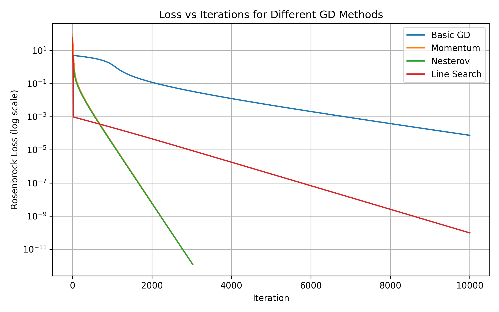
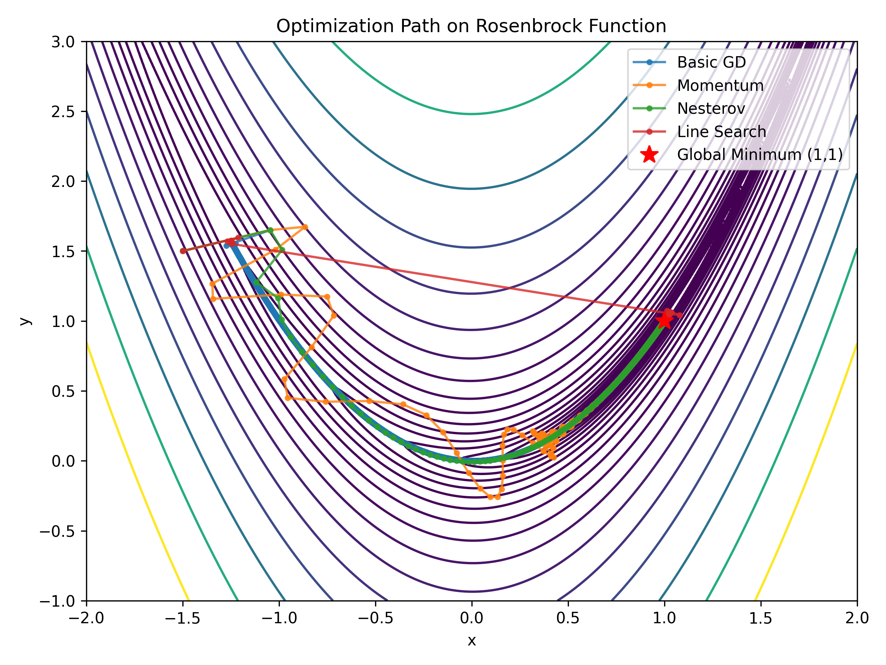

# 🧮 Gradient Descent on Rosenbrock’s Function

The **Rosenbrock function** is a classic non-convex test function used to evaluate optimization algorithms:

\[
f(x, y) = (a - x)^2 + b(y - x^2)^2
\]
where \( a = 1 \) and \( b = 100 \).

It has a **global minimum** at \( (x, y) = (1, 1) \), but the narrow, curved valley makes it a challenge for basic optimization methods.

---

## ⚙️ Method

This project implements **Gradient Descent (GD)** from scratch in Python and explores several variations:

- **Constant learning rate**
- **Adaptive step size (line search)**
- **Momentum**
- **Nesterov acceleration**

### Features

- Tracks convergence via loss vs. iterations plots.
- Visualizes the optimization trajectory on the Rosenbrock function’s contour plot.
- Compares convergence behavior across methods.

---

## 📊 Results

| Method | Convergence Speed | Behavior Near Valley |
|:--------|:----------------:|:--------------------|
| Basic GD | Slow | Oscillates |
| GD + Momentum | Faster | Smooth convergence |
| GD + Nesterov | Fastest | Stable and accurate |

**Visualizations:**
- 
- 

The optimization trajectory clearly approaches the global minimum at **(1, 1)**.

---

## 🧩 Files

| File | Description |
|------|--------------|
| `gradient_descent_rosenbrock.ipynb` | Jupyter notebook with full implementation |
| `README.md` | Project overview |
| `requirements.txt` | Dependencies |

---

## 🚀 How to Run

```bash
# Clone this repository
git clone https://github.com/HenrikGundestrup/optimization-portfolio/gradient-descent-rosenbrock.git
cd gradient-descent-rosenbrock

# Install dependencies
pip install -r requirements.txt

# Open the notebook
jupyter notebook gradient_descent_rosenbrock.ipynb

